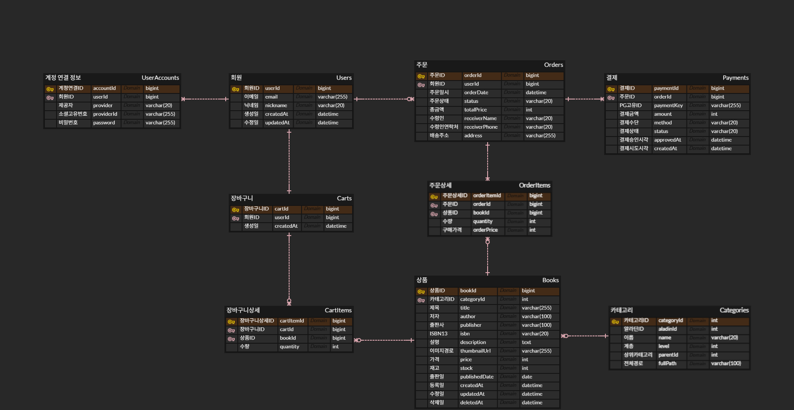

# 📗 Online Bookstore (Backend)

Spring Boot 기반의 도서 이커머스 플랫폼 백엔드 프로젝트입니다.  
주문, 결제, 인증과 같은 핵심 도메인을 직접 설계하고 구현하는 것을 목표로 합니다.

---

## 🛠️ Tech Stack

### Language
- Java 17

### Framework
- Spring Boot 4.0.3
- Spring MVC

### Database
- MySQL

### ORM
- Spring Data JPA

### Security
- JWT (구현 중)
- OAuth 2.0 (예정)

### Payment
- Toss Payments API (연동 예정)

### Tools
- Version Control: Git / GitHub, SourceTree
- Build Tool: Gradle

---

## 📊 Database ERD

---

## ✅ 체크 리스트

### 🛠️ Setup & Infrastructure
- [x] Spring Boot 프로젝트 초기 세팅
- [x] Backend 모듈 분리 (폴더 구조 구성)
- [x] MySQL 연동 및 권한 설정
- [x] GitHub 저장소 연결 및 초기 커밋

### 🗄️ Database
- [x] ERD 설계
- [x] 테이블 생성 및 관계 설정
- [ ] 초기 데이터 적재

### 🔐 Authentication
- [ ] JWT 기반 회원가입 / 로그인 구현
- [ ] Access / Refresh Token 구조 설계
- [ ] OAuth 2.0 (Kakao / Google) 연동

### 📦 E-Commerce Domain
- [ ] 도서 목록 조회 API
- [ ] 도서 상세 조회 API
- [ ] 장바구니 담기 / 수량 변경
- [ ] 주문 생성 (Cart → Order 변환)
- [ ] 주문 상태 관리 (PENDING, PAID 등)

### 💳 Payment
- [ ] Toss Payments API 연동
- [ ] 결제 승인 / 실패 처리
- [ ] 결제 취소 (환불) 로직
- [ ] Payment 상태 관리 및 이력 저장

### ⚡ Advanced
- [ ] 재고 관리 및 동시성 처리
